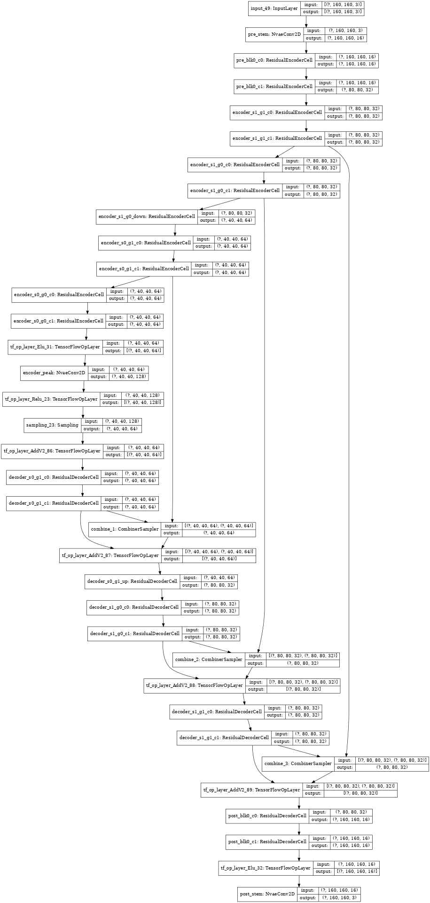

## Tensorflow implementation of NVAE:  A Deep Hierarchical Variational Autoencoder

My best shot at implementing the NVAE paper publish 8 July, 2020: https://arxiv.org/abs/2007.03898

Here's a tiny version of the NVAE created from this code.
* num_scales=2
* num_groups_per_scale=2
* num_cells_per_group=2
* num_latent_per_group=20
* num_enc_channels=16
* num_prepost_blocks=1
* num_prepost_cells_per_block=2

