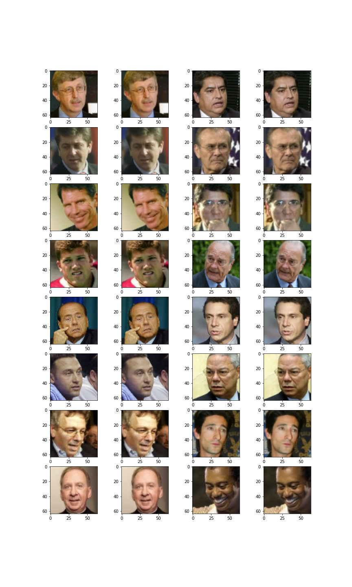
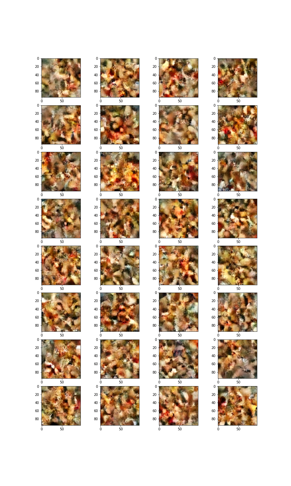
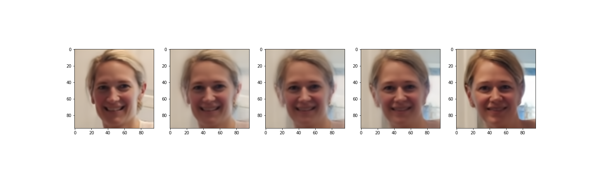
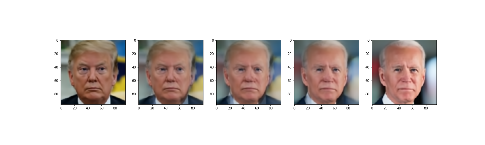
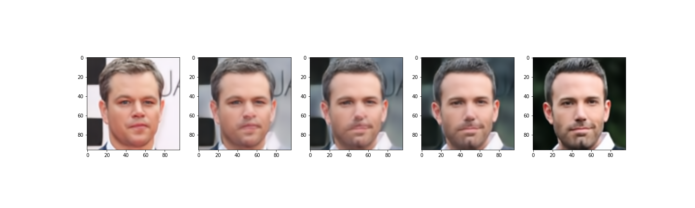
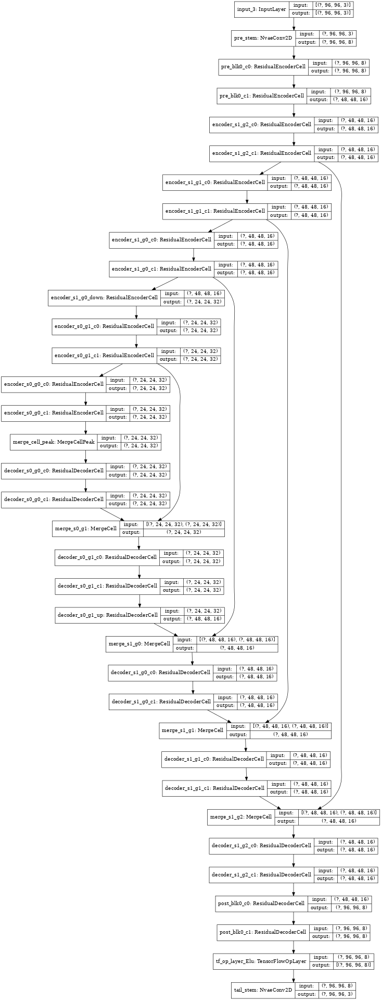

### (WIP) Unofficial Tensorflow implementation of *NVAE:  A Deep Hierarchical Variational Autoencoder*

**(WIP) WORK IN PROGRESS**

TF implementation of the NVAE paper published 8 July, 2020: https://arxiv.org/abs/2007.03898

The authors of that paper also published their own version in PyTorch:  https://github.com/NVlabs/NVAE

This is my attempt to recreate it in Tensorflow 2.3, though sampling doesn't quite work yet.

Features and Limitations:
* ✓ Written in Tensorflow 2.3, Python 3.8.2
* ✓ Dynamic multi-scale, multi-group, multi-cell architecture ✓
* ✓ Spectral Normalization via tensorflow_addons ✓
* ✓ Adaptive Group Sizes ✓
* ✓ Added the ability to blend two images by merging their sampled p(z|z<l) ✓
* ✗ Residual normal distribution (not implemented) ✗ 
* ✗ Normalizing flows (not implemented) ✗ 
* ✗ Sampling doesn't work quite right, yet ✗ 

Models were trained with a GTX 970 w/ 4GB of GPU RAM. 

### Reconstruction of 64x64 face images passing through NVAE
Only minimal degradation of images going back and forth through both sides (encoder & decoder)

### Generation of 64x64 face images 
Clearly have a bit more work to do...

### Merging faces
This seems to work pretty well when both input faces have similar alignment and pose

### TF/Keras Architecture Diagram
This is what the architecture of a **TINY** NVAE looks like.  
* num_enc_channels=8
* num_scales=2
* num_groups_per_scale=3
* num_cells_per_group=2
* num_latent_per_group=8
* num_prepost_blocks=1
* num_prepost_cells_per_block=2

(Note that the Celeb64 network presented in their paper/project, uses 3 scales, 20 groups per scale.  If I did the math right, that's 330M trainable parameters)

### Residual Cells
This is from the paper.
* C is the input number of channels
* EC is the expanded number of channels (usually 3x or 6x)
* BN = Batch Normalization
* SE = Squeeze-Excitation Layer/Network 
  * https://towardsdatascience.com/squeeze-and-excitation-networks-9ef5e71eacd7
* Swish is an activation function in the ReLU/ELU/SELU family

